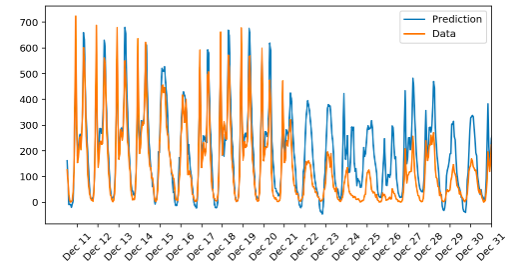

## Bike_sharing_project_using_NN

### Project from Deep Learning Nanodegree - Udacity

I’ve built my own neural network from scratch in my_answers.py file (later on, the file content is imported to our notebook).

Firstly, I created Neural Network class with the init function acommodating the number of input, hidden and output nodes. Next, I initialized the weights, defined the activation function and learning rate. 

The values for hidden, output nodes, number of iterations and the learning rate are being set later and can be modified until we get the desired accuracy. 

Then, I defined the train function that includes the feed-forward pass, backpropagation, the weights update after each iteration and a run function. All these functions are defined after the train function.

In the notebook I started by cleaning and organizing the data, then splitting them into training, test and validation datasets. Next, NN class instance is being created with the input values and hyperparameters passed as arguments. 

With the use of training and validation losses we can see how the model performs during the iterations. I end up with validation loss at 0.183 vs the training one at 0.092 which means that our model is overfitting - generalizing the pattern of the first two-thirds of the month on the last third of the month.
